# Voice Chatbot System

A modular voice-to-voice chatbot with **full Brazilian Portuguese support** that integrates:
- **whisper.cpp** for real-time speech recognition (PT-BR multilingual model)
- **Ollama** with **TinyLLaMA-PTBR** for language model inference (custom Portuguese model)
- **Piper TTS** for text-to-speech synthesis (Brazilian Portuguese voice)

## Quick Start

1. **Prerequisites:**
   ```bash
   # Install CPU-only Ollama (recommended to avoid GPU compatibility issues)
   sudo pacman -S ollama  # Remove ollama-rocm if installed

   # Start Ollama and pull TinyLLaMA base model
   ollama serve &
   ollama pull tinyllama
   ```

2. **Setup Python environment:**
   ```bash
   cd fucking_with_AI/chatbot/
   python -m venv venv
   source venv/bin/activate
   pip install pygame requests numpy pyaudio
   ```

3. **Create custom Portuguese model:**
   ```bash
   # Build the custom tinyllama-ptbr model (one-time setup)
   ollama create tinyllama-ptbr -f Modelfile.ptbr

   # Verify the model was created
   ollama list | grep tinyllama-ptbr
   ```

4. **Test the system:**
   ```bash
   source venv/bin/activate
   python run_chatbot.py --test
   ```

5. **Run the voice chatbot:**
   ```bash
   source venv/bin/activate
   python run_chatbot.py
   ```

6. **Clear conversation history (fresh start):**
   ```bash
   python run_chatbot.py --clear-history
   ```

## Architecture

### Overview - Main Pipeline

The chatbot follows a simple voice-to-voice pipeline with full Brazilian Portuguese support:


**You speak Portuguese → AI responds in Portuguese → You hear Portuguese**

---

### Detailed System Architecture

Complete system showing all components, state management, and feedback prevention:

```mermaid
flowchart TD
    A["🎤 Microphone"]
    B["VAD & Recording"]
    C["WhisperSTT"]
    D["ConversationManager"]
    E["OllamaLLM"]
    F["PiperTTS"]
    G["AudioPlayer"]
    H["🔊 Speaker"]

    A --> B
    B --> C
    C --> D
    D --> E
    E --> F
    F --> G
    G --> H
    G -.->|Feedback Prevention:<br/>pause/resume recording| B

    I["StateManager<br/>(Listening/Processing/Speaking)"]
    I -.-> B
    I -.-> E
    I -.-> G

    style A fill:#1976d2,stroke:#0d47a1,stroke-width:3px,color:#fff
    style B fill:#1976d2,stroke:#0d47a1,stroke-width:3px,color:#fff
    style C fill:#f57c00,stroke:#e65100,stroke-width:3px,color:#000
    style D fill:#388e3c,stroke:#1b5e20,stroke-width:3px,color:#fff
    style E fill:#f57c00,stroke:#e65100,stroke-width:3px,color:#000
    style F fill:#f57c00,stroke:#e65100,stroke-width:3px,color:#000
    style G fill:#7b1fa2,stroke:#4a148c,stroke-width:3px,color:#fff
    style H fill:#7b1fa2,stroke:#4a148c,stroke-width:3px,color:#fff
    style I fill:#388e3c,stroke:#1b5e20,stroke-width:3px,color:#fff
```



**Component Types:**
- 🔵 **Blue** - Input/Recording (Microphone, VAD)
- 🟠 **Orange** - Processing (STT, LLM, TTS)
- 🟣 **Purple** - Output (AudioPlayer, Speaker)
- 🟢 **Green** - Management (ConversationManager, StateManager)

**Key Features:**
- 🇧🇷 **Full Brazilian Portuguese** - STT, LLM, and TTS all configured for PT-BR
- 🔁 **Acoustic Feedback Prevention** - Recording pauses during TTS playback
- 🔒 **Thread-safe Shutdown** - Clean exit without segmentation faults
- 🎙️ **Voice Activity Detection** - Automatically detects when you stop speaking

## Modules

- **`config.py`** - Configuration management (model paths, language settings)
- **`whisper_stt.py`** - Speech-to-text using whisper.cpp with VAD and recording
- **`ollama_llm.py`** - Language model interface (supports custom models)
- **`piper_tts.py`** - Text-to-speech synthesis (multilingual support)
- **`audio_utils.py`** - Audio playback and state management
- **`conversation.py`** - Conversation history and context
- **`voice_chatbot.py`** - Main controller orchestrating everything
- **`Modelfile.ptbr`** - Custom Ollama model configuration for PT-BR

## Usage Examples

### Basic Voice Chat
```bash
python run_chatbot.py
```

### Test TTS Only
```bash
python run_chatbot.py --say "Olá, isso é um teste"
```

### Run System Tests
```bash
python run_chatbot.py --test
```

### Export Conversation
```bash
python run_chatbot.py --export conversation.md
```

## Configuration

The system uses default paths configured for Brazilian Portuguese but can be customized via environment variables or by editing `config.py`:

**Default Configuration:**
- **Whisper**: `ggml-base.bin` (multilingual, PT-BR language setting)
- **Ollama**: `tinyllama-ptbr` (custom model, see Modelfile.ptbr)
- **Piper**: `pt_BR-faber-medium.onnx` (Brazilian Portuguese voice)

**Environment Variables:**
```bash
export WHISPER_MODEL_PATH="/path/to/whisper/model"
export OLLAMA_MODEL="tinyllama-ptbr"  # or another custom model
export PIPER_MODEL_PATH="/path/to/piper/models"
```

## States

The chatbot operates in different states:

- **Listening** 👂 - Waiting for user speech
- **Processing** 💭 - Generating AI response
- **Speaking** 🔊 - Playing TTS audio

## Features

- **Real-time speech recognition** with voice activity detection (VAD)
- **Natural conversation** with TinyLLaMA optimized for Brazilian Portuguese
- **Conversation memory** with automatic saving and context awareness
- **Silence detection** to know when user finished speaking
- **Acoustic feedback prevention** - automatically pauses recording during TTS playback
- **Thread-safe shutdown** - prevents segmentation faults on exit (Ctrl+C)
- **Robust error handling** with automatic retry and model warm-up
- **Modular design** for easy customization and testing
- **Export capabilities** for conversation history
- **CPU-only operation** for broad hardware compatibility
- **Full PT-BR support** - Speech recognition, language model, and TTS all in Portuguese

## Troubleshooting

### Ollama not available
```bash
# Make sure Ollama is running
ollama serve &

# Check if model is available
ollama list
ollama pull tinyllama

# Test basic functionality
ollama run tinyllama "Hello, how are you?"
```

### AMD GPU ROCm Compatibility Issues (gfx1031)
**Issue**: Model runner crashes with "rocBLAS error: Cannot read TensileLibrary.dat for GPU arch: gfx1031"

**Root Cause**: ROCm version incompatibility after system updates. The ROCm libraries don't support gfx1031 architecture in newer versions.

**Solutions**:
1. **Force CPU-only mode** (simplest):
   ```bash
   export OLLAMA_NUM_GPU=0
   # or
   OLLAMA_NUM_GPU=0 ollama serve
   ```

2. **Rollback Ollama version** (if you updated recently):
   ```bash
   # Check recent updates
   grep ollama /var/log/pacman.log | tail -5

   # Try to rollback to previous version
   sudo pacman -U /var/cache/pacman/pkg/ollama-rocm-0.11.11-1-x86_64.pkg.tar.zst
   ```

3. **Use different ROCm version** or wait for gfx1031 support in newer ROCm releases

4. **Check ROCm logs**:
   ```bash
   journalctl -u ollama --no-pager -n 50
   ```

**Note**: This issue occurred after `pacman -Syu` on 2025-09-20 (Ollama 0.11.11 → 0.12.0). **SOLVED** by using CPU-only `ollama` package instead of `ollama-rocm`. The final product will run on CPU-only systems anyway.

### Audio issues
```bash
# Test audio system
python run_chatbot.py --test

# Check if microphone is working
arecord -d 5 test.wav && aplay test.wav
```

### Whisper not working
Check the paths in `config.py` and ensure:
- `whisper-cli` binary exists and is executable
- Model file (currently using `ggml-base.bin`) exists
- Microphone permissions are granted

**Performance Optimization**: For better performance on RPi4, consider downloading the smaller `ggml-tiny.bin` model (75M vs 142M):
```bash
cd ~/whisper.cpp/models
bash download-ggml-model.sh tiny
# Then update config.py to use ggml-tiny.bin
```

### Custom Language Model (Brazilian Portuguese)

**✅ SOLVED**: The chatbot now uses a custom Ollama model configured for Portuguese responses.

**Solution**: Custom Modelfile approach (`Modelfile.ptbr`)
- Creates a new model `tinyllama-ptbr` based on `tinyllama:latest`
- Includes system instruction: "Você é um assistente útil e prestativo. Sempre responda em português brasileiro..."
- Model is "baked" with Portuguese instruction, ensuring consistent PT-BR responses

**How to rebuild/modify the custom model:**
```bash
# Edit Modelfile.ptbr to change system instructions
nano Modelfile.ptbr

# Rebuild the model
ollama create tinyllama-ptbr -f Modelfile.ptbr

# Test it
ollama run tinyllama-ptbr "Olá, como você está?"
```

**Previous Issue** (now resolved):
- TinyLLaMA would respond in English despite Portuguese input
- Conversation context was causing garbled responses
- Fixed by using custom Modelfile with PT-BR system instruction

### Segmentation Fault on Shutdown

**✅ SOLVED**: The chatbot now shuts down cleanly without segmentation faults.

**Solution**: Thread-safe shutdown sequence in `whisper_stt.py`
- Set `is_running = False` flag BEFORE closing audio streams
- Wait for recording thread to finish with `thread.join(timeout=2.0)`
- Only then close PyAudio/ALSA resources
- Prevents race condition where thread tries to read from closed stream

**How to test:**
```bash
# Start chatbot
python run_chatbot.py

# Wait for listening state
# Press Ctrl+C

# Should see clean shutdown:
# 🛑 Stopping Voice Chatbot...
# 🛑 Whisper STT stopped
# ✅ Voice Chatbot stopped
# (no segmentation fault)
```

**Previous Issue** (now resolved):
- Pressing Ctrl+C during listening state caused segmentation fault (core dump)
- Recording thread was still accessing PyAudio stream after it was closed
- Fixed by proper thread synchronization and shutdown order

## Development

To add new features or modify behavior:

1. **Custom LLM prompts**: Edit `Modelfile.ptbr` and rebuild model with `ollama create`
2. **Different models**: Modify paths in `config.py`
3. **Language switching**: Change model in `config.py` (e.g., `pt_BR-faber-medium.onnx` ↔ `en_US-lessac-medium.onnx`)
4. **New audio processing**: Extend `audio_utils.py`
5. **Custom conversation handling**: Modify `conversation.py`
6. **VAD tuning**: Adjust `silence_threshold` in `config.py` (use debug mode to see RMS levels)

## Dependencies

**Python Packages:**
- Python 3.7+
- pygame (for audio playback)
- requests (for Ollama API)
- numpy (for audio utilities)
- pyaudio (for microphone input)

**External Tools:**
- whisper.cpp (compiled with `whisper-cli` binary)
- Ollama (CPU-only recommended, `ollama` package)
- Piper TTS (with PT-BR model: `pt_BR-faber-medium.onnx`)

**Models:**
- Whisper: `ggml-base.bin` (142MB, multilingual)
- Ollama: `tinyllama-ptbr` (custom, built from `Modelfile.ptbr`)
- Piper: `pt_BR-faber-medium.onnx` (63MB, Brazilian Portuguese voice)
