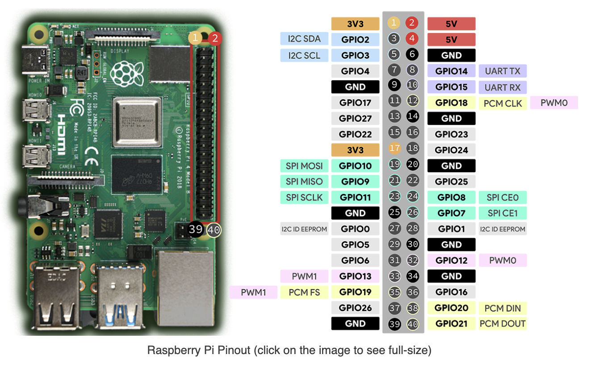

MFRC522 → Raspberry Pi (SPI0 / CE0)

MFRC522	    Função	        GPIO	    Pino físico no Pi
3.3V	    Alimentação	    3V3	            1 (ou 17)
GND	        Terra	        GND	            6 (ou 9/14/20/25/30/34/39)
SDA         Chip Select	    GPIO8           24
SCK	        Clock SPI	    GPIO11          23
MOSI	    SPI MOSI	    GPIO10          19
MISO	    SPI MISO	    GPIO9           21
RST	        Reset	        GPIO25	        22
IRQ	        Interrupção	    (não usar)	    —

Buzzer          Raspberry Pi
+	        GPIO17 (BCM) / pino físico 11	
-	        GND / pino físico 6	

sudo raspi-config
# Interface Options -> SPI -> Enable
sudo reboot

sudo apt update
sudo apt install -y python3-pip
pip3 install mfrc522 gpiozero --break-system-packages

sudo nano teste.py:

#!/usr/bin/env python3
import sys
import time
from mfrc522 import SimpleMFRC522
from gpiozero import Buzzer

# =========================
# CONFIGURAÇÕES
# =========================
BUZZER_GPIO = 17  # GPIO17 (pino físico 11)

# MFRC522: usando SPI0 + CE0 (/dev/spidev0.0) por padrão com SimpleMFRC522
reader = SimpleMFRC522()
buzzer = Buzzer(BUZZER_GPIO)

NL = "\n"

def beep(times=2, on=0.05, off=0.05):
    for _ in range(times):
        buzzer.on()
        time.sleep(on)
        buzzer.off()
        time.sleep(off)

def startup_beep():
    # 3 bipes curtos, semelhante ao seu “OK” no Arduino
    beep(times=3, on=0.05, off=0.05)

def wait_handshake():
    """
    Replica a lógica do Arduino que espera 'OK' antes de iniciar.
    Aqui, esperamos 'OK' via stdin (terminal).
    Se você NÃO quiser isso, basta comentar a chamada no main().
    """
    # Se estiver rodando sem terminal (stdin fechado), segue direto.
    if not sys.stdin or sys.stdin.closed:
        return

    while True:
        line = sys.stdin.readline()
        if not line:
            # stdin não disponível (por exemplo, serviço), segue sem bloquear
            return
        if line.strip().upper() == "OK":
            startup_beep()
            return

def uid_int_to_hex(uid_int: int) -> str:
    """
    SimpleMFRC522 retorna UID como inteiro.
    Converte para HEX maiúsculo. Mantém número par de dígitos (bytes completos).
    """
    hex_str = format(uid_int, "X")  # maiúsculo
    if len(hex_str) % 2 != 0:
        hex_str = "0" + hex_str
    return hex_str

def main():
    # Handshake (opcional). Para desativar: comente a linha abaixo.
    wait_handshake()

    try:
        while True:
            # Bloqueia até aproximar um cartão
            uid, _text = reader.read()
            uid_hex = uid_int_to_hex(uid)

            print(uid_hex, flush=True)

            # Bipe duplo ao ler
            beep(times=2, on=0.05, off=0.05)

            # Semelhante ao delay(2000) do Arduino
            time.sleep(2.0)

    except KeyboardInterrupt:
        pass
    finally:
        buzzer.off()

if __name__ == "__main__":
    main()
